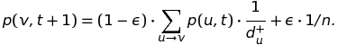

# Simple Web Search Engine (C++)

## Project Overview

This project will be to build a simple web search engine from scratch. At a high level, a search engine is based on the following components:

1. A crawler, which tries to retrieve all the pages from the web.
2. A program that parses the web pages to extract the relevant information, such as text, links, etc. You will do this here; not for HTML or another language (that would be a bit too much work), but for now just an extremely stripped-down version of Markdown.
3. A program that has access to a local copy of all stored and parsed pages, and provides quick lookup of all the pages that contain the words of the query.
4. A ranking algorithm that takes all results and puts them in an order of relevance to the given query.
5. # 

## Specifications

### Overview

You are encouraged to use any and all data structures provided by the STL in this assignment. However, you may**not**use anything from the `<algorithm>` library.

Your actual search engine application will need a list of all the webpages to search. This would normally be done with some kind of web crawler application but we will just provide a text file (called an**index**file) that will contain the names of all the webpage files you need to parse and be able to search. To keep things simple, the webpages will be files, specified by their filepath.

Your program will also receive a series of search commands in a second text file, which we'll call the query file, and specifies the searches made by the user.

Lastly, your program will output the results of the search commands to a third text file. Your program should be called `search` , typing `make search` should compile your program. 

We recommend that you create a subdirectory `data` to store this index file and the other webpage files just to keep your code and data files separated.

The contents of `index.txt` are the file names of the web pages themselves, one per line. Each web page is stored in its own file. You may assume that each file specified in `index.txt` exists. Your program should then read in all the web pages whose file name was listed in the index. There will be no format errors in the index file other than possibly blank lines, which you should just skip and continue to the next line.

### The Configuration File

To avoid an ever-increasing number of parameters at the command line, you should code your program so that it only gets one parameter, the path to a configuration file. If the user does not provide one, this should default to `config.txt` in the current directory. Your configuration file should be of the following form:

```text
# comments
# more comments
<parameter1> = <value1> #comments
# comments
<parameter2> = <value2> 
<parameter3> = <value3>
```

In other words, for any line, anything coming after a `#` is a comment and should just be ignored. All other lines should be of the form `<parameter> = <value>`. (The angled brackets only indicate that this is a generic form - you will not put those brackets there. See below.) The spaces are optional, and your program should be able to handle any number of 0 or more spaces before and after the `=`.

We will introduce more parameters below. For now, in reworking your earlier homeworks, the only possible parameters would be INDEX_FILE (all-capitals), QUERY_FILE, and OUTPUT_FILE, whose values will be the path to its location. For reading parameters, the order in which they are given in the configuration file should not matter.

We will not test your program with incorrectly formatted configuration files. However, if you want to avoid problems in your own testing, it may make sense to do something graceful in that case. Here is an example of a file (with a few other variables, most of which are just made up for this example).

```text
# My configuration file
INDEX_FILE  =     ./google_index.txt
# Here are some important parameters
PI=3.14159  #circumference of a circle
E=2.71828 # Base of the natural logarithm
# The output file is given below
OUTPUT_FILE = data/subdirectory/myoutput.txt
```

### The Query File

The contents of `query.txt` are the commands made by the user, one per line. A command will be one of the following:

- A single word: the user wants to see all the pages that contain the given word.
- `AND word1 word2 ... wordN`: the user wants to see all the pages that contain all of the given words. The number of words here can be arbitrary. There will always be at least one whitespace between each element (`AND`and any of the search term(s)).
- `OR word1 word2 ... wordN`: the user wants to see all the pages that contain at least one of the given words. The number of words here can be arbitrary. Same rules for whitespace as for AND queries.
- `PRINT page`: the user wants to view the specified webpage.
- `INCOMING page`: the user wants to see all the pages which have a link to the specified webpage.
- `OUTGOING page`: the user wants to see all the pages which the specified webpage links to. Don't worry (yet) about whether the page actually exists.
- If a command consists of `AND`, `OR`, `PRINT`, `INCOMING`, or `OUTGOING` with no additional strings, then you should treat this as a single word search for the specified word.
- Any other type of query (such as "word1 word2") should be considered an error; print the error message `Invalid query` to the output file, and proceed to the next query.

After a search command (that is, any command except PRINT), output the number of matched files and a new line, and then the names of each matched files to the output file, one per line.

After a print command, output the name of the requested file and a new line, and then print the contents of the specified file (see below for details).

Queries should be case-insensitive, so if the user typed "USC", and a page contained "usc", that page should be displayed.

### The Webpages

To determine if a file contains a given word, you will need to parse it. You will need to parse normal text and links in our Markdown format.

The contents of a webpage file will consist of letters, numbers, and special characters. The interpretation is that any special character (other than letters or numbers) can be used to separate words, but numbers and letters together form words. For instance, the string `Computer-Science# 104 is really,really5times,really#great?I don't_know!` should be parsed into the words "Computer", "Science", "104", "is", "really", "really5times", "really", "great", "I", "don", "t", "know".

In addition to text, you should be able to parse MD links of the form `[anchor text](link_to_file)` where `anchor text` is any text that should actually be displayed on the webpage and `(link_to_file)` is a hyperlink (or just file path) to the desired webpage file. A few notes about these links:

- The anchor text inside the `[]` could be anything, except it will not contain any `[`, `]`, `(`, or `)`. It should be parsed like normal text described in the previous paragraph
- The `link_to_file` text will not have any spaces, will not contain any `[`, `]`, `(`, or `)`, and should be read as one single string (don't split on any special characters).
- There may be text immediately after the closing `)`, or immediately preceding a `[`. You should just treat it as a new word.
- You will never see the characters `[`, `]`, `(`, or `)` except as described above. So for example, a file will never start with the `]` character, since it must have a `[` beforehand.

The goal is to extract all unique text words and identify all the links (i.e. all the `link_to_file` s found in the `(...)` part of a link. You will likely want to store all of this inside a `WebPage` class.

If the contents of a file are...

```text
Hello world [hi](data2.txt). Table chair desK, t-bone steak.
```

...then the identified words should be: `Hello`, `world`, `hi`, `Table`, `chair`, `desK`, `t`, `bone`, `steak`. The identified links should contain only `data2.txt`.

You will want a function that prints the contents of a webpage (to handle the `PRINT` command). Overloading an appropriate operator would be the most elegant way to do this. You should print the page's text exactly as seen in the file except when you encounter a link. For links you should just print the anchor text in brackets, but not the parentheses or the file name. So for the above file, you would output:

```text
Hello world [hi]. Table chair desK, t-bone steak.
```

To generate this display text you do not have to compute and store it ahead of time but are welcome to open the file and read/parse the file contents each time the `PRINT` query is encountered.

### Web Crawler

New web pages are created all the time, and a search engine wants to discover them. This is done by a separate piece of code called the **crawler**.

A crawler still needs a few seed pages to start from, and those will be provided to you in a seed file. The difference is that there may be many more pages beyond what is specified in the file. Your crawler should parse each page it finds and evaluate all outgoing links, following the ones it doesn't know about yet, and then continue from those. Along the way, your crawler will write its own index file (using the same format as the index file from the previous assignment) that your search engine can then use.

You should write a standalone application for the crawler which should be compiled via your makefile with the command `make crawler`. It will be called with the name of a configuration file (or none, as per above). There are two possible parameters in the configuration file:

```text
INDEX_FILE: The path to the file that is used to "seed" the search.
OUTPUT_FILE: The path to the file that you should overwrite 
             with a list of all pages reachable from the seeds.
```

The crawler should not interact with the user, and just write the output file that contains the paths/names of all pages that it discovers in the crawl. The exploration must happen using the **DFS algorithm**, implemented either recursively or with a stack. You should write the page names in the order in which you **first** discover them. The files in the seed list should be explored in the given order. Within a page, the links should be explored (and written) in the order in which they occur in the page. A link leading to a page that you have already explored should not be explored again.

Notice that you might be given links to files that don't exist (just like a 404 error on the web). Your program should handle this gracefully, and not crash or create entries for non-existent pages in the output file.

Note that crawler is a stand-alone application. Running your search program assumes the crawler has already been run: it doesn't run it again.

### Expand the Set of Candidate Search Results

Suppose that you search for "AND car company", but Ford lists "automobile manufacturing company" on their page instead. We could of course try to "understand" language, and find synonyms or near-synonyms, but that's hard. The link structure lets us do something that works almost as well.

We will say that the "candidate set" for a query is the set of all pages satisfying the query (as before), as well as all pages that either (1) link to such a page, or (2) are linked to from such a page. In other words, you add the targets of all inlinks and outlinks of your original set of hits to get the "candidate set". You should revisit your old code to instead display the entire candidate set in the sense defined here.

How does this help us? So long as at least one page lists "car company" and links to Ford, you will find the Ford page among your search results. Of course, this means that you now have a larger number of candidates to look through, which is where a good ranking comes in.

### PageRank

PageRank is what set Google apart from its competitors in the late 1990s, when it gained a large market advantage that it still enjoys today. (They did a number of other things later, but at the start, PageRank was the main difference.) To emulate this performance, you will implement a version of PageRank here, and use it as your sorting criterion for displaying the web pages. The page with highest PageRank should be displayed first.

Different sources have slightly different definitions of PageRank, so to be specific, here are a few details. (See also our lecture notes and slides for more explanation - what we give here assumes that you have read and mostly understood those.)

- First, we will only focus on the candidate set. We will pretend for the rest of the discussion (and computation) that none of the other pages exist. This also means that all links from/to other pages will be ignored as though they never existed. When we talk about the "in-degree" or "out-degree" of a node, this will be with respect only to candidate nodes.
- We add to each page a self-loop, i.e., an outgoing link to itself and consequently an incoming link from itself (even if it didn't have one before). So the graph consists of all candidate nodes, and all directed edges between them, which includes a self-loop from each node to itself, as well as all links between them that were in actual web pages.
- We write n for the number of nodes in this graph, d+(v) for the number of outgoing edges of node v, and d-(v) for the number of incoming edges of node v.
- We assume that the random surfer starts at a uniformly random node, so he starts at each node with probability 1/n.
- At each step, the random surfer makes one of two choices:
  1. With probability ε (see below), he restarts at a uniformly random node. That is, he jumps to each node with equal probability 1/n.
  2. With the remaining probability 1-ε, he follows an outgoing link (chosen uniformly at random) from his current node v. That is, for each directed edge (v,u) (including the self loop), he next goes to u with probability 1/d+(v).
- He does this for t steps (see below). At this point, for each node v, there is a probaility p(v,t) that the random surfer is now at node v. This is the PageRank of node v.

A few comments are in order here: 

1. The "actual" definition of PageRank is the limit as t goes to infinity. But in practice, people (including Google) do exactly what we do here: stop after a small number of steps. 

2. ε and t are two parameters of the system. These parameters should be set in your configuration file. Their names should be RESTART_PROBABILITY (which corresponds to ε) and STEP_NUMBER (which corresponds to t) (all-caps). Typically, the values that one would use are ε being roughly 0.15, and t somewhere around 20.

If you want to know how to compute the PageRank values iteratively, notice that



You can iterate over these (while being careful to use the values from the previous iteration until you have computed all the new values).

If you would like to play around with an implementation, there is an interactive [Illustration of PageRank](http://www.graui.de/pageRank.htm) available online, but recall that it likely has a few differences from the version we're asking you to implement.

While implementing the PageRank algorithm in isolation is not overly hard (the update rule you were given above is almost all you need), making it interact smoothly with your other code will require a bit of thought.

Once you have implemented all of this infrastructure, you should update your code so that results are organized by PageRank, when displaying lists of webpages via a keyword search. For incoming/outgoing links, sorting by PageRank makes little sense, so don't worry about doing that.

### Runtime Consideratons

Your program will be very slow if, every time you execute a search command, you have to parse all of the webpages (yes, you will lose substantial points if that happens). Instead, you will likely want to parse all of the webpages*once*, before you execute any queries. You can store the results in data structures that, when provided a word, quickly produces the `std::set` of pages which contain that word.

To maintain a good runtime for these functions, recall the following facts about sets:

1. Their data is internally sorted, and the `set<T>::iterator` walks through the set in sorted order.
2. It takes `O(n)` time total to create a `set<T>::iterator` and walk through all of the data.

### How to Plan

Before writing a single line of code, you should think carefully about what classes and functions you will want. Here are some hints and suggestions for what to think about.

1. What STL data structure might be appropriate for producing a `set` of webpages, given a search word?
2. As hinted in the previous section, you will likely want to have a `WebPage` class: what variables and functions should this have? At minimum, you will want to track the words in the file, the outgoing links, and the incoming links.
3. You will likely want a function that is devoted to parsing files and extracting all of the words and links (and storing them in `set` s).
4. When you parse a file, you can create the set of outgoing links at that time. The set of incoming links may not be known yet, and should be added as you encounter them. A problem you may run into is, when you find an outgoing link, you may not have created the `WebPage` for that page yet, and so you will not be able to add this as an incoming link yet. How should you handle this? One possible solution would be to create all of the `WebPage`s upfront, and then start parsing.

# Sources Cited

“CSCI 104 - Spring 2018 Data Structures and Object Oriented Design.” *CSCI 104 – HW4*, bits.usc.edu/cs104/assignments/hw4.html.

“CSCI 104 - Spring 2018 Data Structures and Object Oriented Design.” *CSCI 104 – HW4*, bits.usc.edu/cs104/assignments/hw6.html.
